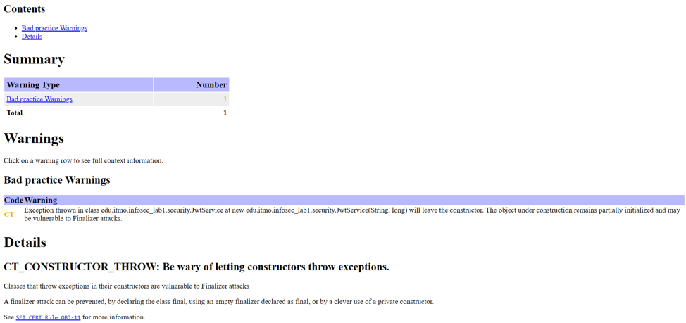
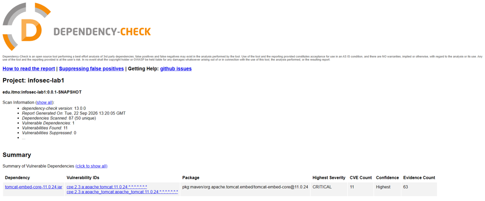
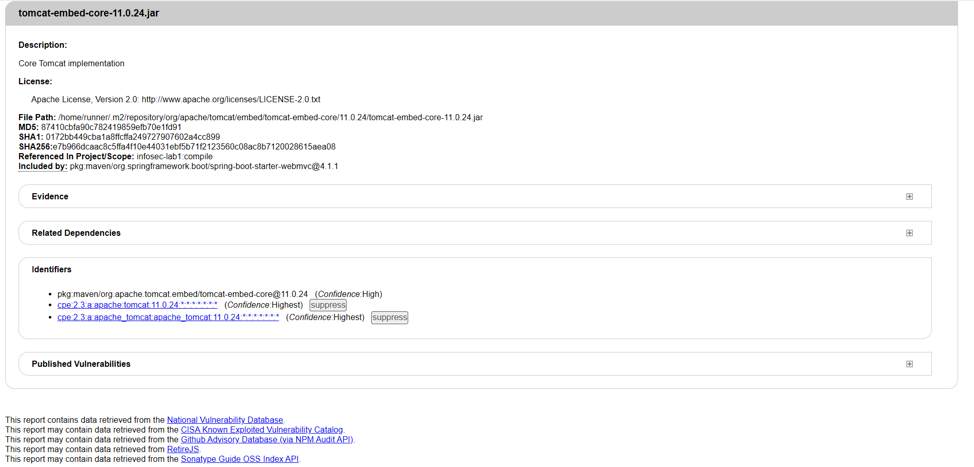
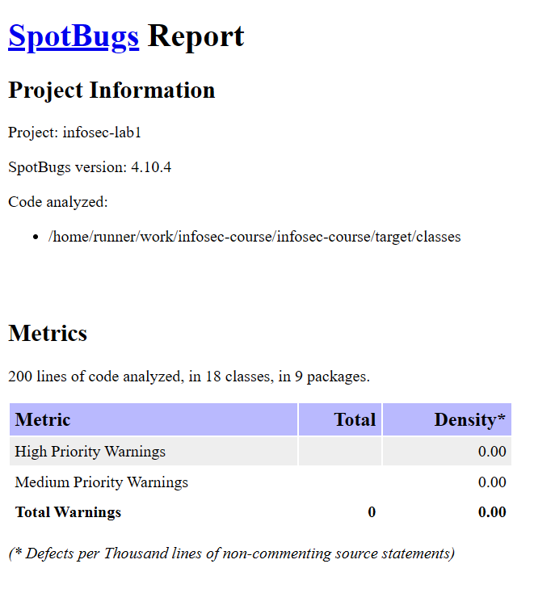
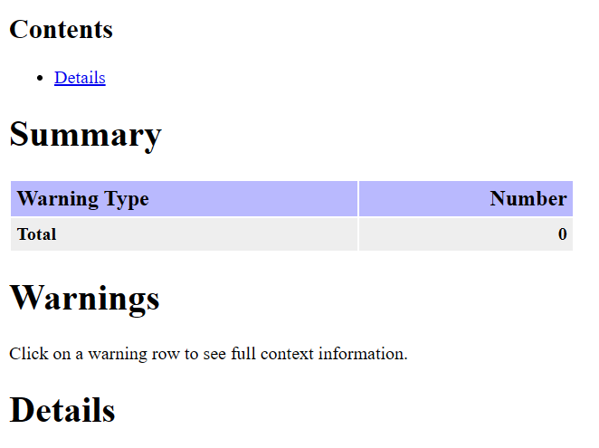
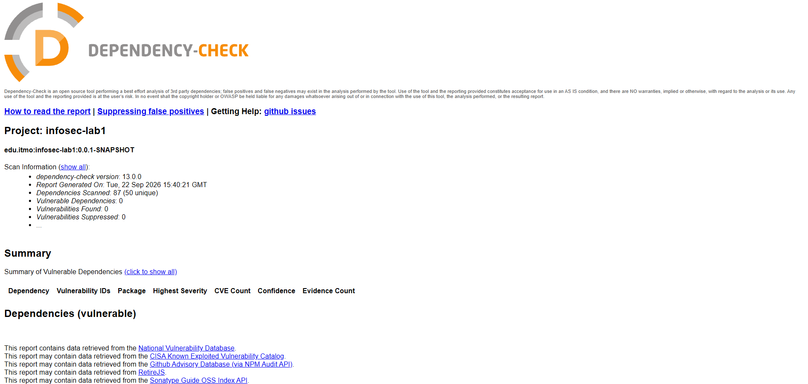

# Защищённый REST API

Проект реализует простой REST API с аутентификацией по JWT и набором мер защиты от
распространённых веб-уязвимостей (SQL-инъекции, XSS).
Непрерывная интеграция (GitHub Actions) включает сборку, статический анализ (SpotBugs +
FindSecBugs) и анализ зависимостей (OWASP Dependency-Check).

## Стек

- Java 25, Maven (wrapper `mvnw`)
- Spring Boot 4.1.1
- Spring Data JPA + Hibernate, PostgreSQL
- Bean Validation (Jakarta Validation)
- JWT: `io.jsonwebtoken:jjwt` 0.13.0 (HMAC-SHA256)
- BCrypt: `spring-security-crypto`

## Запуск

Приложение читает конфигурацию из переменных окружения (`src/main/resources/application.yaml`):

| Переменная     | Назначение                                              |
|----------------|---------------------------------------------------------|
| `DB_URL`       | JDBC URL PostgreSQL (например `jdbc:postgresql://localhost:5432/infosec`) |
| `DB_USERNAME`  | Пользователь БД                                        |
| `DB_PASSWORD`  | Пароль БД                                              |
| `JWT_SECRET`   | Секрет для подписи JWT (не менее 256 бит / 32 символа) |
| `NVD_API_KEY`  | Ключ NVD API (нужен для локального запуска OWASP Dependency-Check) |

Пример (Windows PowerShell):

```powershell
$env:DB_URL="jdbc:postgresql://localhost:5432/infosec"
$env:DB_USERNAME="postgres"
$env:DB_PASSWORD="..."
$env:JWT_SECRET="<случайная_строка_не_короче_32_символов>"
.\mvnw spring-boot:run
```

Таблица `users` создаётся автоматически (`ddl-auto: update`).

## API

Все эндпоинты работают с JSON.

### `POST /auth/register` — регистрация

Ожидает регистрационные данные, создаёт пользователя и возвращает JWT:

```json
{
  "username": "alice_01",
  "email": "alice@example.com",
  "password": "Password123"
}
```

Ограничения полей:
- `username` — 3–50 символов, только `[A-Za-z0-9_-]`;
- `email` — валидный email, до 50 символов;
- `password` — 8–50 символов, минимум одна строчная, одна заглавная латинская буква
  и одна цифра, без пробелов.

Пример:

```bash
curl -X POST http://localhost:8080/auth/register \
  -H "Content-Type: application/json" \
  -d '{"username":"alice_01","email":"alice@example.com","password":"Password123"}'
```

Ответ — JWT-токен (строка). Коды ошибок: `400` (не прошла валидация),
`409` (username или email уже заняты).

### `POST /auth/login` — вход

```bash
curl -X POST http://localhost:8080/auth/login \
  -H "Content-Type: application/json" \
  -d '{"username":"alice_01","password":"Password123"}'
```

Ответ — JWT-токен. Коды ошибок: `404` (пользователь не найден),
`401` (неверный пароль).

### `GET /api/data` — список пользователей (защищённый)

Требует заголовок `Authorization: Bearer <token>`:

```bash
curl http://localhost:8080/api/data \
  -H "Authorization: Bearer <JWT-токен>"
```

Ответ — массив объектов `{"username": "...", "email": "..."}`. Пароли не отдаются.
Без токена или с невалидным/просроченным токеном — `401`.

## Меры защиты

### Аутентификация и безопасность учётных записей

- **JWT (HS256)** — при логине/регистрации выдаётся подписанный токен
  (`security/JwtService.java`). Ключ подписи берётся из `JWT_SECRET`; для HMAC-SHA256
  требуется ключ ≥ 256 бит, иначе `Keys.hmacShaKeyFor` выбрасывает ошибку при старте.
- **Проверка токена в фильтре** (`security/JwtFilter.java`) — фильтр перехватывает запрос,
  требует заголовок `Authorization: Bearer ...`, проверяет подпись, срок действия и
  корректность токена. Любая ошибка (невалидная подпись, истекший/повреждённый токен)
  приводит к `401 UNAUTHORIZED`.
- **Публичные пути** — `/auth/login`, `/auth/register` исключены из фильтра
  (`shouldNotFilter`); всё остальное доступно только с валидным токеном.
- **Хеширование паролей BCrypt** (`config/PasswordConfig.java`) — при сохранении пароль
  хешируется с солью (`BCryptPasswordEncoder`), при логине сверяется только
  `passwordEncoder.matches(...)`. В открытом виде пароль нигде не хранится.
- **Политика пароля** — набор правил Bean Validation
  (`RegisterRequest`): длина от 8, требуются строчные/заглавные буквы и цифры, запрещены
  пробелы.
- **Разделение кодов ошибок логина** для различных сценариев (пользователь не найден —
  `404`, неверный пароль — `401`), единый безопасный формат `ProblemDetail`.

### Защита от SQL-инъекций

- Все обращения к БД идут через **Spring Data JPA**: запросы формируются JPQL/derived-методами
  репозитория (`findByUsername`, `findByEmail`), параметры всегда передаются как bind-параметры
  через JDBC, строка пользователя никогда не конкатенируется в SQL.
- Поле `username` перед сохранением дополнительно ограничено строгой маской
  `[A-Za-z0-9_-]+`, что исключает попадание произвольных символов.
- Ограничения на уровне схемы: длины колонок (`username`/`email` = 50, `password` = 100,
  для BCrypt-хэша), `nullable = false`, уникальные индексы на `username` и `email`.

### Защита от XSS (Stored/Reflected)

- Вывод пользовательских данных экранируется на уровне ответа: DTO `UserDto`
  (`dto/UserDto.java`) пропускает `username` и `email` через `HtmlUtils.htmlEscape(...)`,
  превращая `<`, `>`, `&`, `"`, `'` в HTML-сущности. Даже если такой символ попадёт в БД,
  он не будет интерпретирован как разметка/скрипт в клиенте.
- Входные данные ограничены строгой маской для `username` (XSS-векторы вида
  `<script>` не проходят валидацию) и проверены на соответствие формату `email`.

## Скриншоты отчетов
### До исправления уязвимостей:
### SAST


### SCA



### После исправления уязвимостей:
### SAST


### SCA
